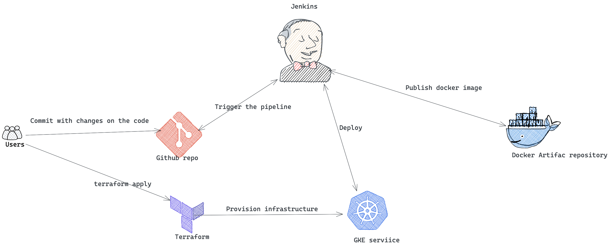
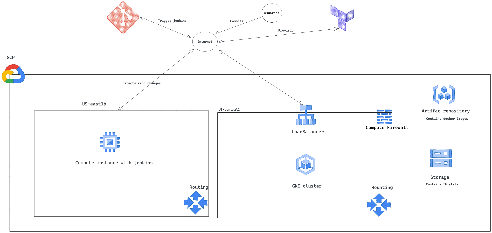

# devops_challenge_gcp  

CI/CD Diagram:

Explainin this one, the users are going to trigger the pipeline each time they make a change on the code, the jenkins vm is going to start the process with the steps:  

- Install - is going to install all the nodejs dependencies
- Test - is going to execute the respective test cases
- Create artifact - Is going to create the docker image
- Publish Artifact - Publish the docker image to the GCR repo
- Deploy - Deploy from the GCR repo to GKE service

For reference go to the repo: https://github.com/MiguelIsaza95/simple-node-js-react-npm-app, https://github.com/MiguelIsaza95/timeoff-management-application and https://github.com/MiguelIsaza95/devops_challenge_ansible

Architecture Diagram:

